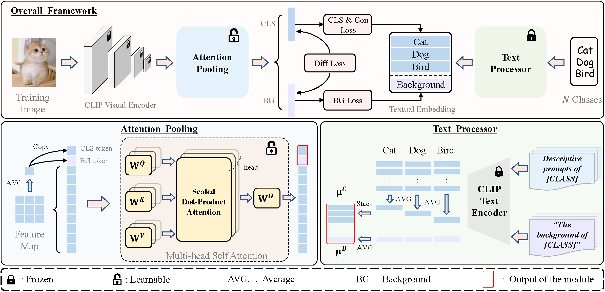

# Region Attention Fine-tuning with CLIP for Few-shot Classification

Official implementation of **[RAFT](https://ieeexplore.ieee.org/abstract/document/10688204/)**.

The paper has been accepted by **[ICME 2024](https://2024.ieeeicme.org/)**.

## Introduction

We propose **RAFT**, i.e., **R**egion **A**ttention **F**ine-**T**uning with CLIP for few-shot classification.
We first freeze the other modules of CLIP and only activate the attention pooling layer in the fine-tuning process. Additionally, we introduce background-relevant features based on the current dataset into both the textual and visual modalities to assist the model's training. Furthermore, to mitigate the issue of overfitting that often occurs during fine-tuning with limited data, we incorporate a consistency constraint that limits the gap between the fine-tuned model and the original CLIP. By combining these strategies, our framework enables the model to learn region-specific attention weights for various downstream tasks, resulting in improved performance.

### Framework


<div align="center">
  
</div>

## Requirements
### Installation
Create a conda environment and install dependencies:
```bash
git clone https://github.com/WideStars/RA-FT.git
# or using ssh: git clone git@github.com:WideStars/RA-FT.git
cd RA-FT

# conda create -n RAFT python=3.10
# conda activate RAFT
# for torch version, we use 2.0.0+cu117

pip install -r requirements.txt
```

### Dataset
Follow [DATASET.md](./doc/DATASET.md) to install ImageNet and other 10 datasets referring to [CoOp](https://github.com/KaiyangZhou/CoOp).

## Get Started
### Configs
The basic running configurations can be modified in `configs/{dataset}.yaml`. And you can also change more arguments in the scripts under the [folder](./scripts/), which have higher priority for setting arguments.

### Running
For ImageNet dataset:
```bash
bash ./scripts/train_imagenet.sh
```
We do the evaluation automatically at the end of training. If you want to evaluate seperately, you can also run:
```bash
bash ./scripts/test_imagenet.sh
```
For other 10 datasets:
```bash
bash ./scripts/train_other_datasets.sh
```

## Acknowledgement
This repo benefits from [CLIP](https://github.com/openai/CLIP) (for CLIP model), [CoOp](https://github.com/KaiyangZhou/CoOp) (for datasets info), [Tip-Adapter](https://github.com/gaopengcuhk/Tip-Adapter) (for code framework) and [CaFo](https://github.com/OpenGVLab/CaFo) (for gpt3_file). Thanks for their wonderful works.

